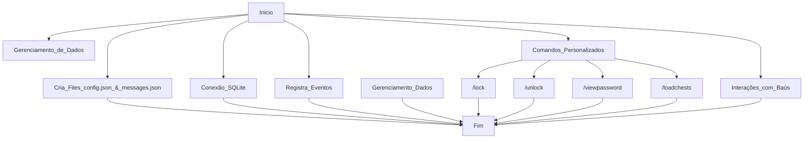

# Blockdata
Plugin para trancar baú com uma senha e chave Minecraft spigot version 1.21.X Tranca o baú com uma senha Destranca o baú com uma senha Permite ao administrador ver a senha do baú Permite administrador ver a senha caso esqueça
(obs: se alguem tentar abrirvem fogo e o mesmo que cai na lava!)

Minecraft command /lock 1233 or /unlock

commands:
  lock:
    description: 'Tranca o baú com uma senha'
    usage: /lock <senha>
  unlock:
    description: 'Destranca o baú com uma senha'
    usage: /unlock <senha>
  viewpassword:
    description: 'Permite ao administrador ver a senha do baú'
    usage: /viewpassword
    permission: viewpassword.use
  loadchests:
    description: Carrega todos os baús trancados do banco de dados
    usage: /loadchests
    permission: admin.loadchests
    permission-message: "Você não tem permissão para usar este comando."
    
# Language altomat
Support BR & EN

    
Destranca o baú com uma senha vai precizar da etiqueta com a senha e quebra o bau no ato do destranque 
quem tranca o bau sempre ganha 2 chave 1 para dar ao amigo ou deixa guardada de reserva... 

# Fluxo Grama - Plugin de Tranca de Baús

# Inicialização do Plugin:

# Quando o plugin é iniciado, ele:

Cria os arquivos config.json e messages.json se ainda não existirem.

Configura a conexão com o banco de dados SQLite para persistir informações dos baús trancados.

Registra os eventos e os comandos como lock, unlock e viewpassword.

# Gerenciamento de Dados:

A classe LockedChests mantém um mapa na memória dos baús trancados.

Os dados são sincronizados com o banco de dados SQLite para evitar perdas entre reinicializações.

# Comandos Personalizados:

/lock [senha]: Tranca um baú com a senha especificada e adiciona uma etiqueta com a senha.

/unlock [senha]: Destranca um baú com a senha especificada.

/viewpassword Admin: Comando para caso alguem esqueça a senha e queira recuperar os itens (apenas o admin)

/loadchests Admin: Comando para Debug e testes de reload (apenas o admin)

Eventos Personalizados:

# Interações com Baús:

Se o jogador clicar em um baú trancado sem a etiqueta correta, receberá feedback sonoro, mensagens ou até efeitos como cabeças de dragão e fogo.

# Destruição de Baús:

Impede que baús trancados sejam destruídos até que sejam desbloqueados.

# Mensagens Localizadas:

Todos os feedbacks ao jogador (mensagens de sucesso, erro, dicas) são traduzidos para o idioma definido em config.json, graças à classe MessageManager

https://www.youtube.com/watch?v=QHVc5ROWEpA
